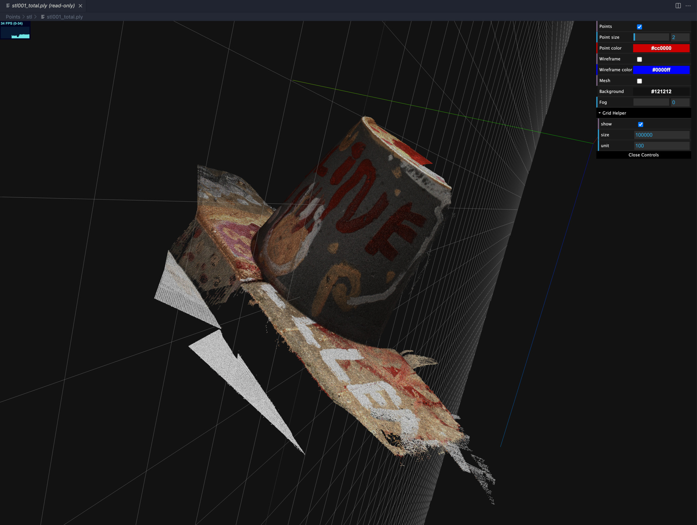

# VSCode 3D Viewer Light

**See in VS Marketplace:** [vscode-3d-preview](https://marketplace.visualstudio.com/items?itemName=tatsy.vscode-3d-preview)

## Description

This extension is inspired by [vscode-3dviewer](https://github.com/stef-levesque/vscode-3dviewer) but has minimal features to preview triangular meshes, and point clouds.

## Features

This extension supports 3D formats equally as [Open3D](http://www.open3d.org/docs/0.9.0/tutorial/Basic/file_io.html) (but partly not support currently). 

|     | point | mesh |
|:---:|:-----:|:----:|
| obj | o | o |
| off | o | o |
| pcd | o | x |
| ply | o | o |
| stl | x | o |
| xyz | o | x |

#### Mesh preview

#### Point cloud preview

#### Large color point cloud

## FAQ

* Q. When I drag&drop a mesh file, a blank display is shown.
    * A. To show a 3D data using this extension, you should first open a workspace including the 3D data that you want to open.

## Reference

* [vscode-3dviewer](https://github.com/stef-levesque/vscode-3dviewer)
* [vscode-pc-viewer](https://github.com/Obarads/vscode-pc-viewer)
* [three.js](https://threejs.org/)

## Lincense

MIT License 2021-2022 (c) Tatsuya Yatagawa
