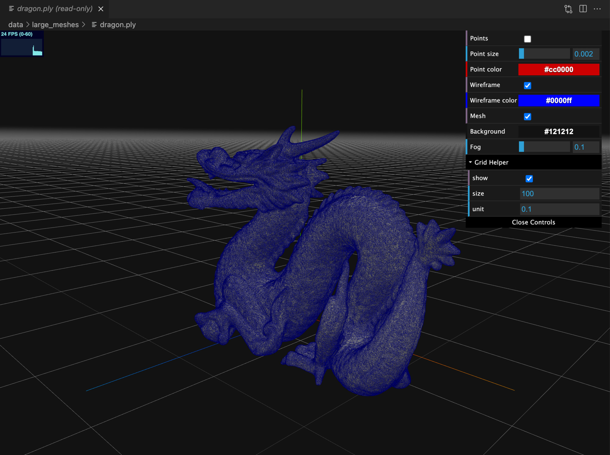
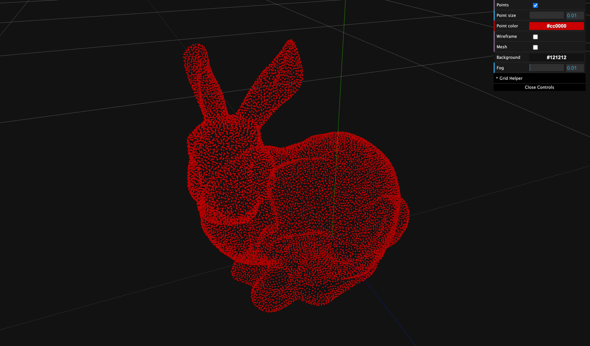
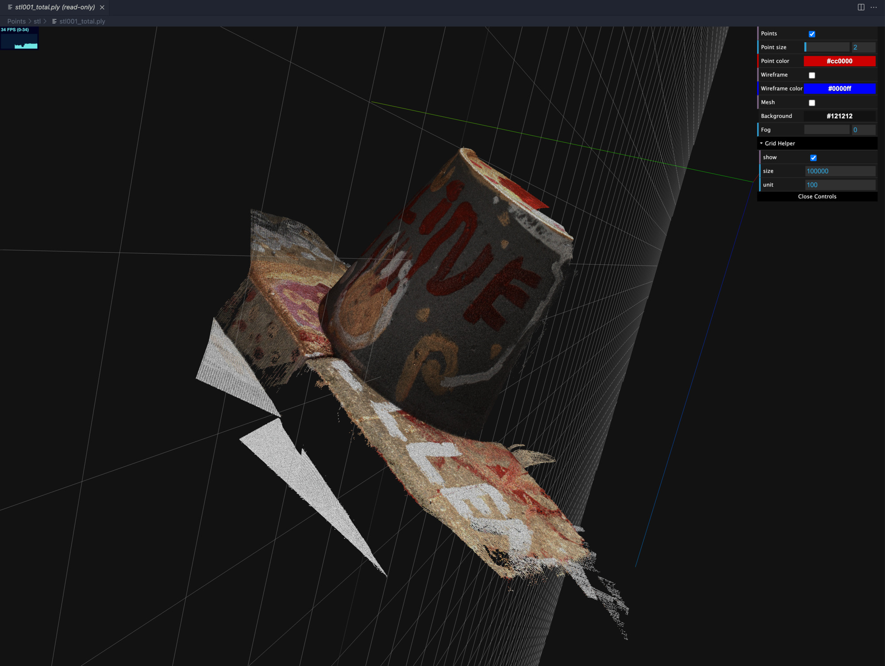

# VSCode 3D Viewer Light

**See in VS Marketplace:** [vscode-3d-preview](https://marketplace.visualstudio.com/items?itemName=tatsy.vscode-3d-preview)

## Description

This extension is inspired by [vscode-3dviewer](https://github.com/stef-levesque/vscode-3dviewer) but has minimal features to preview triangular meshes, and point clouds.

## Features

This extension supports 3D formats equally as [Open3D](http://www.open3d.org/docs/0.9.0/tutorial/Basic/file_io.html) (but partly not support currently).

|     | point | mesh |
|:---:|:-----:|:----:|
| obj | o | o |
| off | o | o |
| pcd | o | x |
| ply | o | o |
| stl | x | o |
| xyz | o | x |

### Mesh preview

### Point cloud preview

### Large color point cloud

## Settings

All settings live under the `3dpreview` namespace and act as the initial values of the control panel shown in the viewer. Most of them can also be changed on the fly from the panel.

| Setting | Default | Description |
|:--|:--|:--|
| `hideControlsOnStart` | `false` | Fold the control panel when the viewer opens. |
| `cameraControls` | `"trackball"` | `"trackball"` allows free rotation in any direction. `"orbit"` keeps the camera upright and cannot pass over the poles. |
| `showMesh` | `true` | Show mesh triangles. |
| `flatShading` | `false` | Use flat shading instead of smooth shading for meshes. STL files are always rendered flat because the format stores no shared vertices. |
| `showWireframe` | `false` | Show the wireframe. |
| `wireframeColor` | `"#0000ff"` | Wireframe color. |
| `wireframeWidth` | `0.5` | Wireframe line width. |
| `showPoints` | `false` | Show the point cloud. |
| `pointColor` | `"#cc0000"` | Point color (used when the file has no vertex colors). |
| `pointSize` | `0.5` | Point size. |
| `pointSizeAttenuation` | `true` | Shrink points with distance from the camera. Disable to keep every point visible at a fixed on-screen size, e.g. for large lidar scans. |
| `lightIntensity` | `1` | Intensity of the directional light that follows the camera. Set `0` to keep only the ambient hemisphere light. |
| `backgroundColor` | `"#121212"` | Background color. |
| `fogDensity` | `0` | Density of the exponential fog. |
| `showGridHelper` | `true` | Show the grid helper. |
| `showAxesHelper` | `true` | Show the axes helper. |

## FAQ

- Q. When I drag and drop a mesh file, a blank display is shown.
  - A. To show a 3D data using this extension, you should first open a workspace including the 3D data that you want to open.

## Reference

- [vscode-3dviewer](https://github.com/stef-levesque/vscode-3dviewer)
- [vscode-pc-viewer](https://github.com/Obarads/vscode-pc-viewer)
- [three.js](https://threejs.org/)

## License

GNU General Public License v3 2021-2025 (c) Tatsuya Yatagawa
